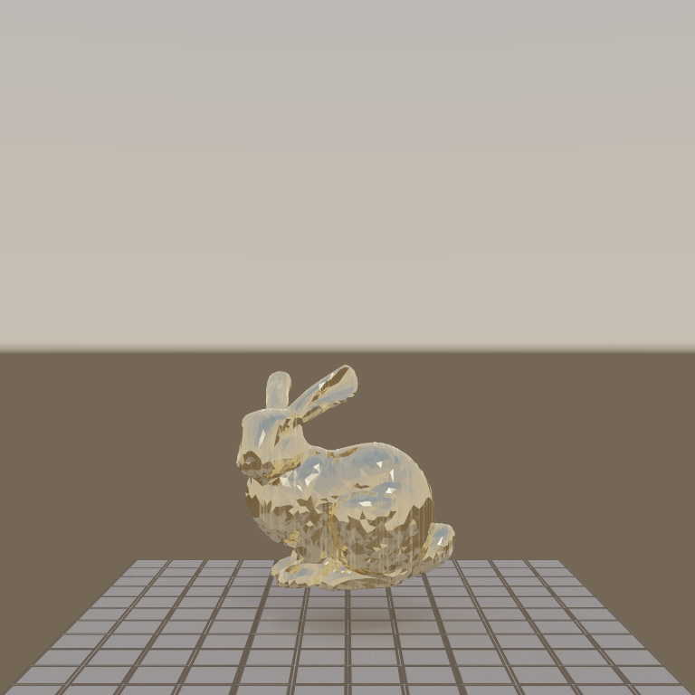
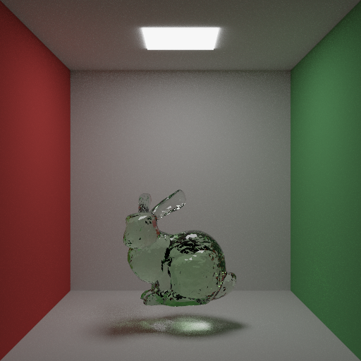
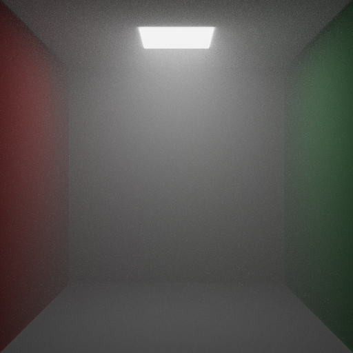
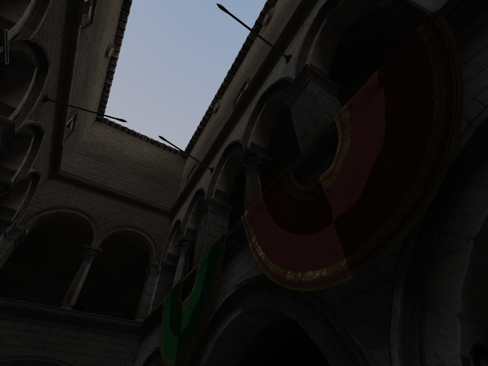
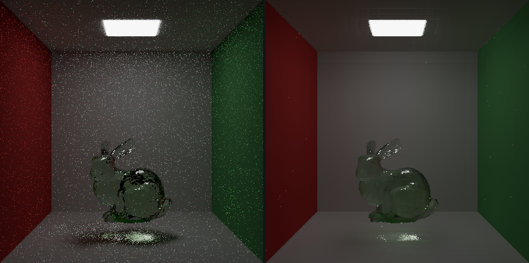

# quasi

[](https://github.com/timthirion/quasi/actions/workflows/ci.yml)
[](https://timthirion.github.io/quasi/)
[](LICENSE)
[](https://doc.rust-lang.org/edition-guide/rust-2021/index.html)
[](https://wgpu.rs)

<table>
  <tr>
    <td align="center" width="50%">
      
      <br><sub><b>PT-env-pbr</b> — Brushed-brass bunny (metallic-roughness map) on a stone-tile normal-mapped floor, lit entirely by an HDR equirectangular sky. Per-texel GGX picks up shimmering sun-glint.</sub>
    </td>
    <td align="center" width="50%">
      
      <br><sub><b>PT-beer-lambert</b> — Stanford bunny in green glass, Beer-Lambert absorption distance-modulated through the body.</sub>
    </td>
  </tr>
  <tr>
    <td align="center">
      
      <br><sub><b>PT-fog</b> — Cornell room filled with homogeneous fog, light scattering off particles in the room, soft halo around the ceiling light.</sub>
    </td>
    <td align="center">
      
      <br><sub><b>PT-sponza-baseline</b> — Crytek Sponza (~262K triangles, 68 PBR textures) lit entirely by an HDR equirectangular sky entering through the open oculus above. First scene at Quasi's complex-geometry tier; first plan toward published-quality renders of architectural assets.</sub>
    </td>
  </tr>
</table>

### Denoising

The same scene at **64 spp** before and after the analytic à-trous
wavelet denoiser (`--denoise` on `render`). Edge-stopping by
normal + depth + colour keeps the bunny silhouette + glass
refraction sharp while flattening the noise in the diffuse
regions. ~50 ms post-process at 384²; no neural net.

<p align="center">
  
</p>

## What is Quasi?

A Rust path tracer that targets **WebGPU** — so the same code runs
natively (Metal / Vulkan / DX12 via [`wgpu`](https://wgpu.rs)) and
inside the browser. One codebase, one shading language ([WGSL](https://www.w3.org/TR/WGSL/)),
one set of tests. The goal is published-quality reference renders
*and* live, interactive widgets you can drop into a blog post —
orbit the camera, flip the integrator, watch convergence — without
recompiling anything for a separate web target.

It's actively in development against a sequence of focused plans
in [`plans/`](plans/). Ten of them have closed so far, each one
shipping a reference render and pinning the math in CPU-side
tests.

## Features

**Materials**
- Textured Lambertian (`PT-textures`)
- GGX microfacet conductors with Smith G + Schlick Fresnel (`PT-ggx`)
- Smooth dielectrics — full Snell + unpolarised Fresnel + TIR (`PT-dielectrics`)

**Participating media**
- Distance-modulated Beer-Lambert absorption inside dielectrics (`PT-beer-lambert`)
- Homogeneous single-scattering fog with NEE-through-volume shadow rays (`PT-fog`)
- Heterogeneous clouds via 3-D density grids, delta tracking +
  ratio tracking, Henyey-Greenstein anisotropy (`PT-cloud` + `PT-hg`)
- OpenVDB ingest pipeline so production cloud data drops straight in (`PT-vdb` + `PT-vdb-ingest`)

**Geometry**
- glTF triangle scenes with embedded material extras
- SAH binned BVH on CPU + WGSL stack-walked traversal (~350× speedup on 20 K triangles)

**Integrator + samplers**
- Multiple-Importance Sampling + Next-Event Estimation
- PCG, Halton, and Sobol samplers (runtime-switchable)

**Runtime**
- Single WGSL megakernel, progressive HDR accumulation, AOV outputs (radiance / albedo / normal / depth)
- Native + WebGPU build from one source

## Quick start

**Windowed renderer:**

```sh
cargo run --release            # opens a window; Esc to quit
```

**Headless render to PNG + EXR:**

```sh
cargo run --release -- render \
    --scene data/gltf/cornell_glass_bunny.gltf \
    --width 512 --height 512 --spp 1024 \
    --out my_render
```

The `--scene` and `--cloud-grid` flags accept any of the
`data/gltf/cornell_*.gltf` scenes and `data/grids/*.qvg` density
grids. Without `--cloud-grid`, the renderer falls back to the
embedded procedural cumulus.

**Browser build:**

```sh
wasm-pack build --target web   # produces pkg/
python3 -m http.server         # then open http://localhost:8000/
```

A live build of `main` is published at
[**timthirion.github.io/quasi**](https://timthirion.github.io/quasi/)
via GitHub Pages. The same `pkg/` powers a minimal
[`embed.html`](https://timthirion.github.io/quasi/embed.html?sampler=sobol&compact=1)
designed for blog `<iframe>` use — pin the sampler, integrator, and
compact mode via query string.

## Architecture

A core renderer crate owns the `wgpu` device + queue, scenes, and
the WGSL path-tracing pipeline; thin native (winit) and web
(canvas) entry points drive it. Path tracing is a WGSL megakernel
rendering to ping-pong HDR textures; verification (convergence,
RMSE-vs-reference) lives in native-only tests.

The tech-stack details, coding conventions, and testing doctrine
live in [`AGENTS.md`](AGENTS.md).

## Where it's going

The forward direction lives in [`plans/ROADMAP.md`](plans/ROADMAP.md);
each shipped feature has its own [`plans/NNNN-*.md`](plans/) file
with the design, milestones, tests, and any "tuning notes worth
remembering" that came out of the work. Plans `0001` through
`0010` have closed; `0011` (this README) is the current one in
flight.

## VDB ingest

Real production cloud data ships as OpenVDB `.vdb` files. The
[`scripts/`](scripts/) folder contains a C++ converter that
resamples a `.vdb` to our `.qvg` density-grid format and the
documented end-to-end pipeline for using the Walt Disney
Animation Studios Cloud Data Set — see
[`scripts/README.md`](scripts/README.md).

## License + credits

This codebase is [Apache-2.0](LICENSE).

The procedurally-baked cumulus in [`data/grids/cumulus_64.qvg`](data/grids/)
is generated by [`examples/gen_cloud.rs`](examples/gen_cloud.rs)
and falls under the same license as the rest of the repo.

If you render with the Disney WDAS Cloud Data Set
(`--cloud-grid data/grids/disney_*.qvg`), the resulting image is
a derivative work of Disney's CC BY-SA 3.0 dataset; credit
accordingly:

> Cloud volume: Walt Disney Animation Studios Cloud Data Set,
> CC BY-SA 3.0.

The Stanford bunny in [`data/obj/stanford-bunny.obj`](data/obj/)
comes from the Stanford 3D Scanning Repository.
